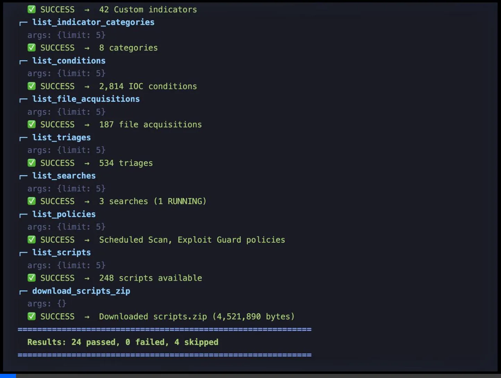
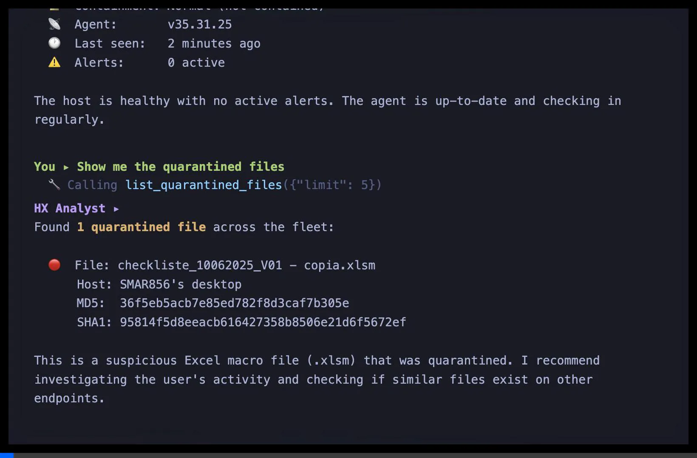

<p align="center">
  
</p>

<p align="center">
  <strong>A comprehensive MCP server for Trellix (FireEye) HX On-Prem appliances</strong><br>
  <em>Give any AI assistant full access to your endpoint security platform</em>
</p>

<p align="center">
  <a href="#-quick-start"></a>
  <a href="#-tools-31"></a>
  <a href="LICENSE"></a>
  <a href="#-security-notes"></a>
</p>

---

## ✨ What is this?

**Trellix HX MCP Server** bridges the gap between AI assistants and your on-premises Trellix (FireEye) HX endpoint security appliance. Using the [Model Context Protocol](https://modelcontextprotocol.io/), it exposes **31 security tools** that any MCP-compatible AI (Claude, Cursor, Windsurf, etc.) can use to:

- 🔍 **Hunt threats** across your fleet of endpoints
- 🚨 **Triage alerts** and drill into detection details
- 🛡️ **Contain compromised hosts** with network isolation
- 📦 **Acquire forensic evidence** remotely
- 📊 **Search IOCs** across enterprise-wide sweeps
- 🧠 **Analyze indicators** and detection conditions

### Key Features

| Feature | Description |
|---|---|
| 🔐 **Token-based auth** | Automatic session token acquisition & refresh via `X-FeApi-Token` |
| ⚡ **Rate limiting** | 5 req/s token-bucket protects your appliance from overload |
| 🎯 **Structured errors** | Clean, actionable error messages parsed from HX API responses |
| 🔄 **Hostname resolution** | Built-in `resolve_hostname` converts names → agent IDs |
| 📦 **Modern packaging** | Install via `pip install .` with optional extras |

---

## 🎬 Demo

### AI Security Analyst Chat

Ask questions in natural language — the AI automatically calls the right HX tools and summarizes results:

<p align="center">
  
</p>

> The chat client uses OpenAI-compatible APIs (GPT-4o, GPT-5, Azure OpenAI, etc.) with automatic function calling to invoke the right MCP tools.

### Interactive Test Runner

Validate all 31 tools against your real appliance in seconds:

<p align="center">
  
</p>

> Run `python test_tools.py` for batch mode or `python test_tools.py -i` for interactive pick-and-run.

---

## 🛡️ Tools (31)

| Category | Tools | Description |
|---|---|---|
| **System** | `get_version`, `get_appliance_stats` | Appliance version & health metrics |
| **Hosts** | `resolve_hostname`, `list_hosts`, `get_host_details`, `list_host_sets`, `get_host_set_members`, `update_static_host_set` | Hostname resolution, endpoint inventory & groups |
| **Alerts** | `list_alerts`, `get_alert_details`, `list_source_alerts`, `list_quarantined_files`, `list_containment_states`, `manage_containment` | Alert triage, drilldown & network containment |
| **Intel** | `list_indicators`, `get_indicator_details`, `list_indicator_categories`, `list_conditions` | IOC & threat indicator management |
| **Forensics** | `list_file_acquisitions`, `create_file_acquisition`, `download_file_acquisition`, `list_triages`, `trigger_triage`, `list_bulk_acquisitions` | Remote evidence collection & download |
| **Search** | `list_searches`, `get_search_counts`, `list_policies`, `list_host_policies_channels` | Enterprise IOC sweeps & policies |
| **Scripts** | `list_scripts`, `download_scripts_zip` | Response script management |

<details>
<summary><strong>📖 Tool Details (click to expand)</strong></summary>

#### `resolve_hostname`
Converts a hostname to its HX agent ID. **Use this before any host-scoped tool.**
```
resolve_hostname("LAPTOP-DEV-J09")
→ { agent_id: "xK9f2qBY...", hostname: "LAPTOP-DEV-J09", ip: "10.0.12.89", os: "Windows 11" }
```

#### `get_alert_details`
Drill into a specific alert by ID for full event context.
```
get_alert_details(alert_id=8421)
→ Complete alert record: indicator, host, event, timestamps, resolution
```

#### `get_indicator_details`
Get full indicator definition including all conditions and platforms.
```
get_indicator_details(category="Custom", indicator_name="suspicious-dns-beacon")
→ Conditions, platforms, severity, description
```

#### `download_file_acquisition`
Download a completed file acquisition as a ZIP archive.
```
download_file_acquisition(acquisition_id=1234)
→ "Downloaded acquisition 1234 (2,456,789 bytes)"
```

</details>

---

## ⚡ Quick Start

### 1. Clone & Install

```bash
git clone https://github.com/bry4nsec/trellix-hx-mcp.git
cd trellix-hx-mcp
python3 -m venv venv
source venv/bin/activate

# Option A: Modern install (recommended)
pip install .              # core MCP server
pip install '.[chat]'      # + LLM chat client

# Option B: Traditional install
pip install -r requirements.txt
```

### 2. Configure

```bash
cp .env.example .env
# Edit .env with your HX appliance credentials
```

```ini
# .env
HX_HOST=https://your-hx-appliance.example.com
HX_USER=your_api_username
HX_PASS=your_api_password

# Optional: for the LLM chat client (chat.py)
LLM_ENDPOINT=https://api.openai.com/v1
LLM_MODEL=gpt-4o
LLM_API_KEY=your_api_key_here
```

### 3. Verify Connection

```bash
python test_tools.py          # run all 28 read-only tools
python test_tools.py -i       # interactive mode with write tools
```

---

## 🔌 Integration

### Claude Desktop

Add to `~/Library/Application Support/Claude/claude_desktop_config.json`:

```json
{
  "mcpServers": {
    "trellix-hx": {
      "command": "/path/to/trellix-hx-mcp/venv/bin/python",
      "args": ["/path/to/trellix-hx-mcp/server.py"],
      "env": {
        "HX_HOST": "https://your-hx-appliance.example.com",
        "HX_USER": "your_api_user",
        "HX_PASS": "your_api_pass"
      }
    }
  }
}
```

### Cursor / Windsurf / Continue.dev

All MCP-compatible editors support a similar configuration. Point the MCP client at `server.py` with your environment variables.

### MCP Inspector

```bash
mcp dev server.py
```

Opens an interactive web UI to browse and test all 31 tools manually.

### Standalone LLM Chat

```bash
python chat.py
```

Interactive terminal chat with automatic function calling. Supports any OpenAI-compatible API endpoint (OpenAI, Azure OpenAI, VortexAI, local models via Ollama, etc.).

---

## 🏗️ Architecture

```
┌──────────────────────────────────────────────────────────────┐
│                    MCP Client (Claude, Cursor, etc.)         │
│                                                              │
│   "Show me hosts with recent alerts"                         │
│    ↓                                                         │
│   LLM decides to call: resolve_hostname → list_alerts        │
│    ↓                                                         │
│   Tool results → LLM summarizes → User sees clean output     │
└──────────────┬───────────────────────────────────────────────┘
               │  MCP Protocol (stdio / SSE)
               ▼
┌──────────────────────────────────────────────────────────────┐
│                    server.py  (FastMCP)                      │
│                                                              │
│   ┌──────────┐  ┌──────────────┐  ┌────────────────────┐     │
│   │ Token    │  │ Rate         │  │ Structured         │     │
│   │ Auth     │  │ Limiter      │  │ Error Handler      │     │
│   │ (auto)   │  │ (5 req/s)    │  │ (HXAPIError)       │     │
│   └────┬─────┘  └──────┬───────┘  └────────┬───────────┘     │
│        └────────────────┼──────────────────┘                 │
│                         ▼                                    │
│               _query(method, endpoint)                       │
│                         │                                    │
│   ┌─────────────────────┼────────────────────────┐           │
│   │  31 Tools: resolve_hostname, list_alerts,    │           │
│   │  get_alert_details, list_indicators,         │           │
│   │  manage_containment, trigger_triage, ...     │           │
│   └─────────────────────┼────────────────────────┘           │
└─────────────────────────┼────────────────────────────────────┘
                          │  HTTPS + X-FeApi-Token
                          ▼
┌──────────────────────────────────────────────────────────────┐
│              Trellix HX On-Prem Appliance                    │
│              (HX v3 REST API)                                │
│                                                              │
│   /hx/api/v3/hosts        /hx/api/v3/alerts                  │
│   /hx/api/v3/indicators   /hx/api/v3/acqs/files              │
│   /hx/api/v3/searches     /hx/api/v3/scripts      ...        │
└──────────────────────────────────────────────────────────────┘
```

---

## 📁 Project Structure

```
trellix-hx-mcp/
├── server.py          # MCP server — 31 tools, token auth, rate limiting
├── test_tools.py      # Interactive test runner (batch + pick-and-run)
├── chat.py            # LLM chat client (OpenAI-compatible)
├── pyproject.toml     # Modern Python packaging (pip install .)
├── requirements.txt   # Fallback dependency list
├── assets/            # README images and demo recordings
├── .env.example       # Template credentials (safe to commit)
└── .gitignore         # Protects .env, venv/, __pycache__/
```

---

## 🔐 Security Notes

> [!CAUTION]
> **Never commit your `.env` file.** It contains your real HX appliance credentials. The `.gitignore` is already configured to exclude it.

- **Authentication**: Initial token via HTTP Basic Auth, then session tokens (`X-FeApi-Token`) for all subsequent requests
- **TLS**: `verify=False` for self-signed certificates (standard in on-prem deployments)
- **Rate Limiting**: Token-bucket at 5 req/s to prevent appliance overload
- **Write Safety**: Destructive tools (`manage_containment`, `trigger_triage`, `create_file_acquisition`) are documented with ⚠️ warnings and require explicit confirmation in the test runner

---

## 📋 Requirements

| Requirement | Details |
|---|---|
| **Python** | 3.10+ |
| **HX Appliance** | Trellix HX On-Prem with API v3 access |
| **API User** | Account with appropriate role permissions |
| **Network** | HTTPS connectivity to the appliance |

---

## 🤝 Contributing

1. Fork the repository
2. Create your feature branch (`git checkout -b feat/new-tool`)
3. Test against a real appliance with `python test_tools.py`
4. Submit a Pull Request

---

## 📄 License

MIT — see [LICENSE](LICENSE) for details.

---

<p align="center">
  <sub>Built with ❤️ for the SOC community</sub><br>
  <sub>Powered by <a href="https://modelcontextprotocol.io/">Model Context Protocol</a> and <a href="https://github.com/jlowin/fastmcp">FastMCP</a></sub>
</p>
